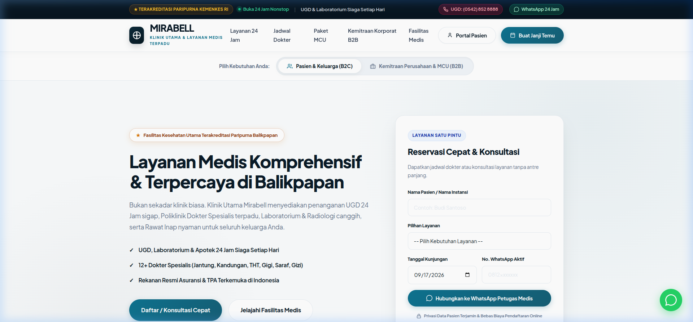
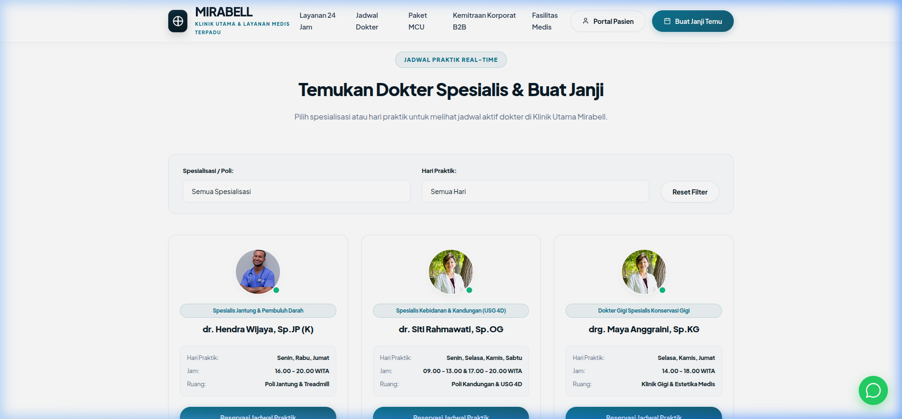
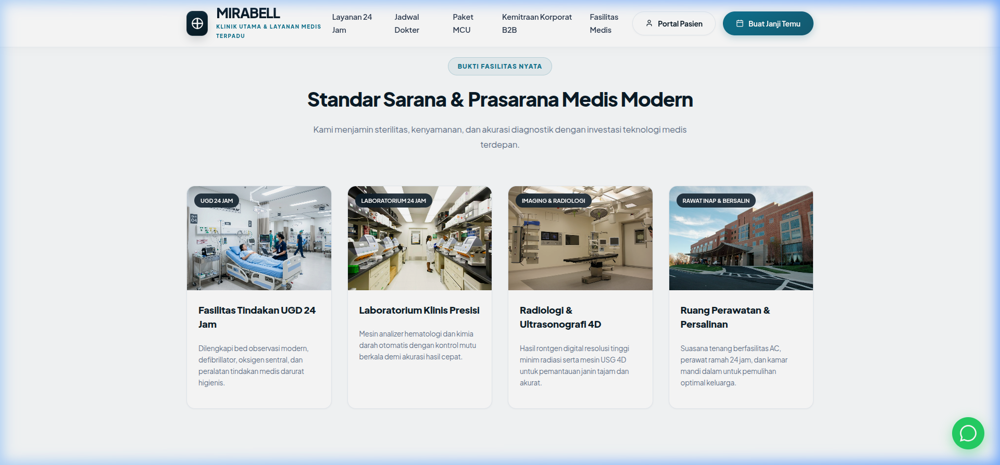
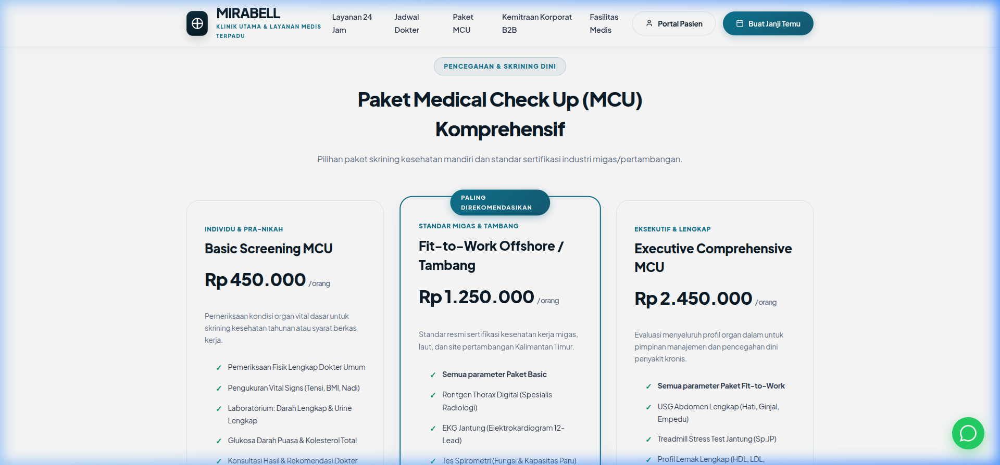
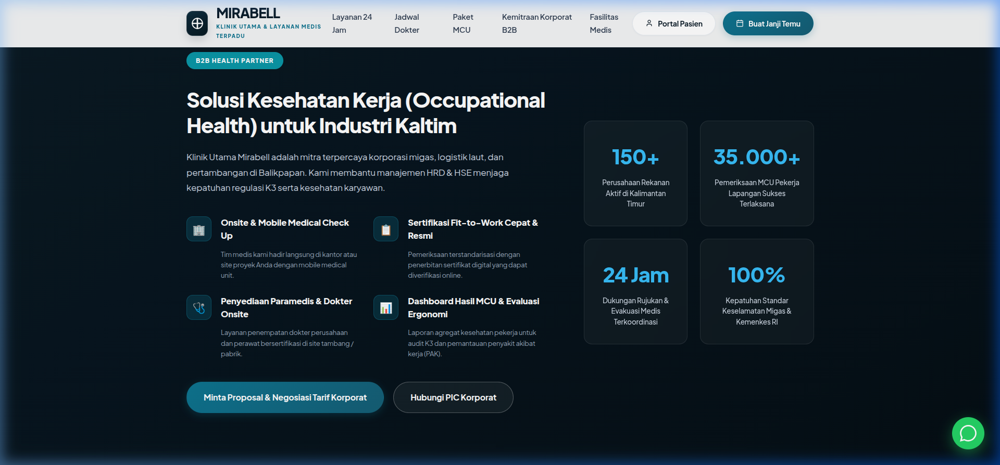

# Website Rebranding: Klinik Utama Mirabell

> **Luxury, Modern & Professional Healthcare Theme & Web Application**  
> Resmi dikembangkan untuk **Klinik Utama Mirabell** (Balikpapan, Kalimantan Timur).  
> Dibangun berbasis **Kadence Child Theme** untuk WordPress serta dilengkapi prototipe mandiri (Standalone Vanilla HTML5/CSS3/ES6+).

---

## 🏥 Latar Belakang & Solusi Rebranding

Berdasarkan audit strategis pada dokumen brand review:
1. **Mengeliminasi *Brand Confusion***: Mirabell kerap disalahartikan publik sebagai klinik kecantikan/skincare. Rebranding ini mengunci identitas kategori secara permanen:  
   **`MIRABELL — KLINIK UTAMA & LAYANAN MEDIS TERPADU`**.
2. **Dual-Audience Segmented Funnel**:
   - **B2C (Pasien & Keluarga)**: UGD 24 Jam, Poliklinik Spesialis Terpadu, Laboratorium & Radiologi, Rawat Inap & Bersalin.
   - **B2B (Korporat & Industri)**: Rekanan resmi *Occupational Health* (K3), MCU Onsite/Mobile, dan sertifikasi *Fit-to-Work* standar industri Migas & Pertambangan Kaltim.
3. **Konversi Tanpa Hambatan (*Frictionless Conversion*)**:
   - Sistem reservasi dan pendaftaran 1-pintu terhubung langsung ke WhatsApp Resmi Petugas Medis (`0811-5067-711`).
   - Jadwal dokter *real-time* dengan foto portrait berjas medis asli serta filter spesialisasi dan hari praktik.
4. **Sentuhan Estetika Luxury & Professional**:
   - Memadukan warna *Sovereign Deep Navy* (`#0A1B28`), *Refined Mineral Teal* (`#0E7490`), aksen emas akreditasi *Champagne Gold* (`#B45309`), dan tipografi modern *Plus Jakarta Sans*.

---

## 📸 Tinjauan Visual Website

### 1. Top Emergency Bar, Navigation & Hero Section (B2C Mode)


### 2. Jadwal Praktik Real-Time & Kartu Dokter Berfoto Asli


### 3. Fasilitas & Sarana Medis Nyata (UGD, Lab, Radiologi, Rawat Inap)


### 4. Paket Medical Check Up (MCU) & Standar Fit-to-Work Migas


### 5. Kemitraan Kesehatan Kerja B2B (Occupational Health)


---

## 🎨 Luxury Design Tokens

| Token | Hex / Nilai | Peruntukan Visual |
| :--- | :--- | :--- |
| **Sovereign Deep Navy** | `#0A1B28`, `#071520` | Top Emergency Bar, Section Kemitraan B2B, Footer |
| **Refined Mineral Teal** | `#0E7490`, `#155E75` | Tombol CTA Utama, Badge Aktif, Aksen Navigasi |
| **Champagne Gold** | `#B45309`, `#FEF3C7` | Badge Akreditasi Paripurna Kemenkes RI, Star Badges |
| **Soft Crimson Emergency** | `#BE123C`, `#FFF1F2` | Indikator UGD 24 Jam & Ambulans Siaga |
| **Canvas Background** | `#FAFCFD`, `#FFFFFF` | Latar belakang bersih dengan spasi lega (*generous whitespace*) |
| **Typography** | `Plus Jakarta Sans` | Modern sans-serif dengan tracking presisi |

---

## 📁 Struktur Repositori

```text
.
├── mirabell-medical-theme.zip     # Arsip tema WordPress siap pasang (Kadence Child Theme)
├── mirabell.docx                  # Dokumen audit strategis & arahan rebranding
├── index.html                     # Prototipe mandiri (Standalone HTML5)
├── style.css                      # Styling prototipe mandiri
├── app.js                         # Logika interaktif prototipe mandiri
├── docs/
│   └── screenshots/               # Dokumentasi visual antarmuka
└── wordpress/
    └── wp-content/themes/
        └── mirabell-medical/      # Source code child theme WordPress lengkap
            ├── style.css          # Deklarasi Kadence Child Theme
            ├── functions.php      # Enqueue aset, font, & fitur WordPress
            ├── front-page.php     # Template homepage lengkap 13 section
            └── assets/
                ├── css/           # mirabell-custom.css (Luxury design tokens)
                ├── js/            # mirabell-custom.js (Audience toggle, dokter filter)
                └── images/        # Foto fasilitas resolusi tinggi & portrait dokter
```

---

## 🚀 Panduan Pemasangan pada WordPress

1. **Persiapan**:
   - Pastikan WordPress Anda telah terpasang dengan theme induk **Kadence** (dapat diunduh gratis via *Appearance > Themes > Add New > Kadence*).
2. **Unggah Tema**:
   - Masuk ke dashboard admin WordPress: `wp-admin`
   - Buka menu **Appearance > Themes > Add New > Upload Theme**.
   - Pilih file arsip [`mirabell-medical-theme.zip`](mirabell-medical-theme.zip).
   - Klik **Install Now**, kemudian klik **Activate**.
3. **Pengaturan Homepage**:
   - Buka menu **Settings > Reading**.
   - Pada opsi *Your homepage displays*, pilih *A static page*.
   - Pilih halaman yang menggunakan template `Mirabell Modern Rebranding Homepage`.
   - Simpan perubahan.

---

## 💻 Menjalankan Prototipe Mandiri (Lokal)

Jika ingin menjalankan prototipe HTML/JS tanpa server WordPress:
```bash
# Menggunakan Python built-in server
python3 -m http.server 8080

# Buka pada peramban
http://localhost:8080
```

---

## 📄 Lisensi & Hak Cipta
Hak Cipta © 2026 **Klinik Utama Mirabell Balikpapan**. Dikembangkan oleh **Arkawidya Web Developer**.
